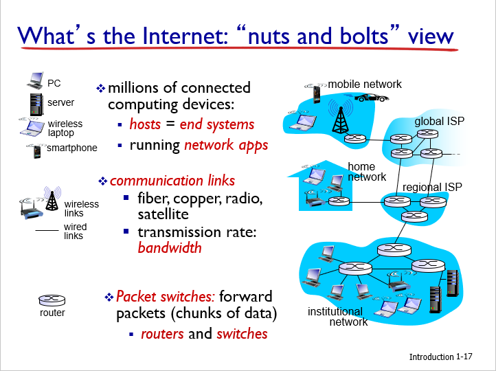
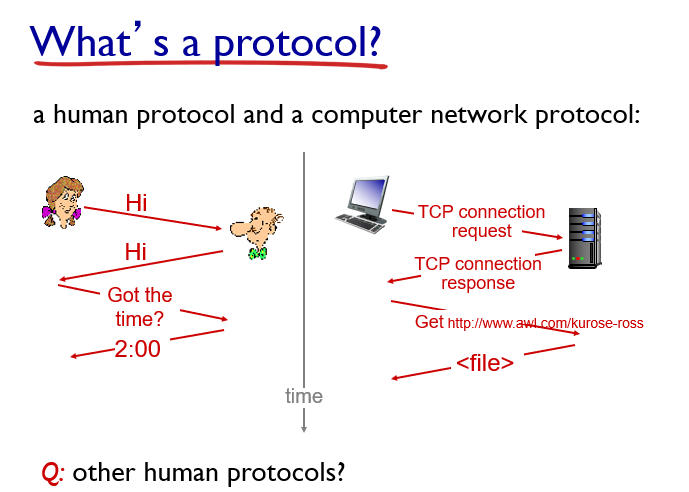
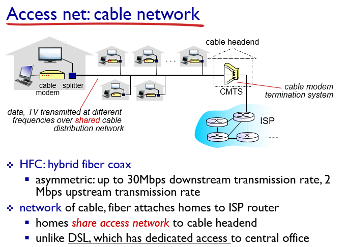
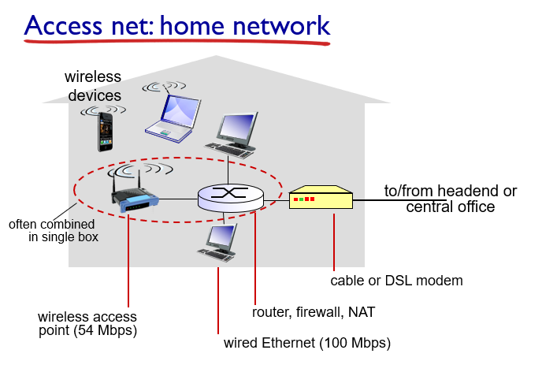

# Chapter 1 Introduction

## 1.1 What is the Internet

### 1.1.1 `nuts ans bolts view`

인터넷을 구성하는 하드웨어, 소프트웨어, 데이터 구성요소로 바라보는 관점이다. 이러한 관점에서 인터넷은 전 세계에 존재하는 수십억 개의 컴퓨팅 장치를 연결하는 네트워크이다.

host system(end system) + cable + data(packet(3계층), frame, signal ...)

호스트 시스템은 통신링크(Communication Link)와 패킷 스위치(Packet switch)로 연결되어 있다.

용어 정리 :

- bandwidth : 호스트 시스템을 연결하는 통신 링크에서 전달할 수 있는 데이터의 전송 속도. 초당 비트수(bps)로 계산한다.
- router와 packet switch : 통신 링크로 이동하는 데이터 패킷이 목적지 호스트 시스템으로 이동할 수 있도록 경로를 지정해주는 장치.
- ISP(Internet Service Provider) : 통신링크와 패킷 스위치등을 설치하여 지역 또는 국가간 네트워크 연결을 제공하는 서비스 업체(SK Broadband, AT&T 등등)
- Internet : network of networks, 인터넷 서비스 제공자(ISP)에 의해서 연결되어 있는 네트워크. 네트워크에서 가장 중요한 점은 reliablity(동일한 기능을 일정하게 제공할 수 있는 능력)
- Protocol : 인터넷에서 데이터를 교환하는 규칙. 대표적으로 TCP/IP가 존재한다.
- IETF : 인터넷 프로토콜에 대한 표준을 정하는 기구. 여기에서 특정 분야에 대한 RFC를 정한다.
- RFC

### 1.1.2 What is `protocol`

서로 소통하는 방법에 대한 규칙이다. packet에 대한 format을 지정하기도 하고, message에 대한 순서, 요청에 대한 action을 지정하기도 한다.

### 1.1.3 `service view`

어플리케이션에 서비스를 제공하는 `infrastructure`. 인터넷을 이용해서 어플리케이션과 엔드 시스템간 데이터를 주고받을 수 있도록하는 프로그래밍 interface api.

## 1.2 Network Edge

### A closer look at network structure

- network edge :
  - hosts : clients and servers
- access networks, physical media : end system을 다른 end system과 연결하는 경로상에서, 가장 첫번째로 만나게 되는 라우터(가장자리 라우터)까지의 네트워크. wired, wireless links
- network core(back bone) : access network를 연결하는 network

> `Cloud Computing` : 유비쿼터스와 비슷한 개념. 언제 어디서든지 인터넷에 연결되어 있다면 사용할 수 있는 컴퓨팅 서비스. 구름 뒤에 가려진 부분처럼, 가려진 공간에서 무언가 시스템을 설치하고 서비스를 제공해서 cloud라는 이름이 붙었다.

### 1.2.1 Access networks(접속 네트워크) and physical media

- Digital subscriber line (DSL) : 전화와 인터넷을 동시에 송수신할 수 있는 형태의 네트워크. 옛날 방식. 업로드 속도와 다운로드 속도의 차이가 존재(다운로드 > 업로드)
- Cable network : 케이블 TV를 제공하는 회선을 이용해서 인터넷도 제공하는 방식.  

cable headend에서 CMTS 까지는 광케이블, cable headend에서 cable modem까지는 동축케이블로 연결되어 있다. 2가지 종류의 케이블이 쓰여서 HGC라는 용어가 붙음. Cable modem에서 통신신호의 업스트림과 다운스트림 채널을 나눈다(업로드, 다운로드 속도가 다름).
- Home network : LAN(Local Area Network)를 이용해서 기업 또는 가정의 end system들을 한 번에 access network에 연결하는 방식. 여러가지 LAN 기술이 있지만 가장 많이 사용하는 방식은 이더넷 케이블을 이용해서 이더넷 스위치에 연결하는 것이다.  
  
가정용 라우터에 AP(Access Pointer)를 달아서 무선 네트워크(`Wifi`, `IEEE 802.11`)를 지원할 수도 있다.
- Wireless access network
