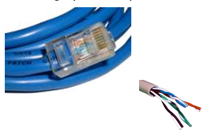
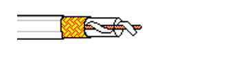
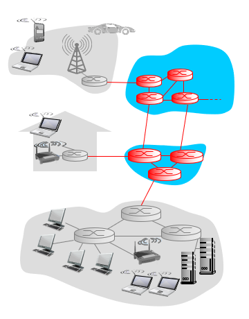
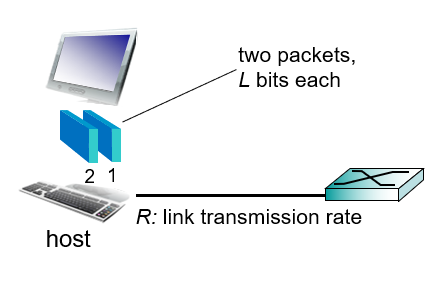
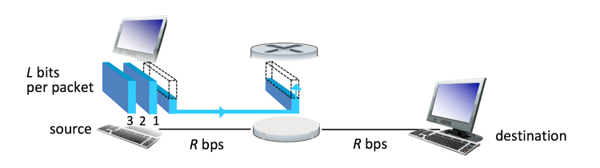
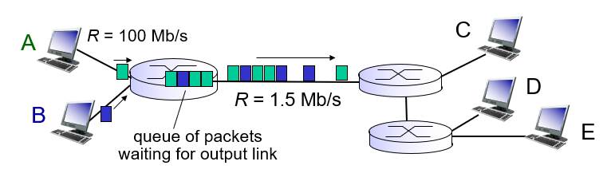
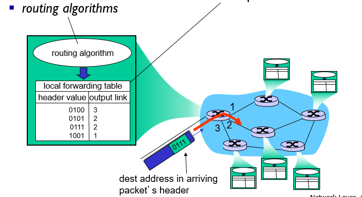
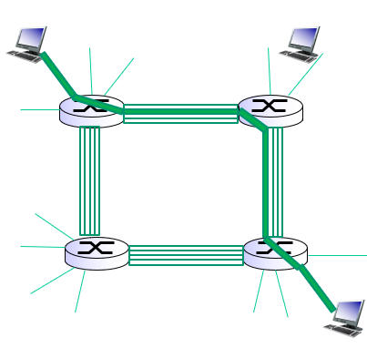
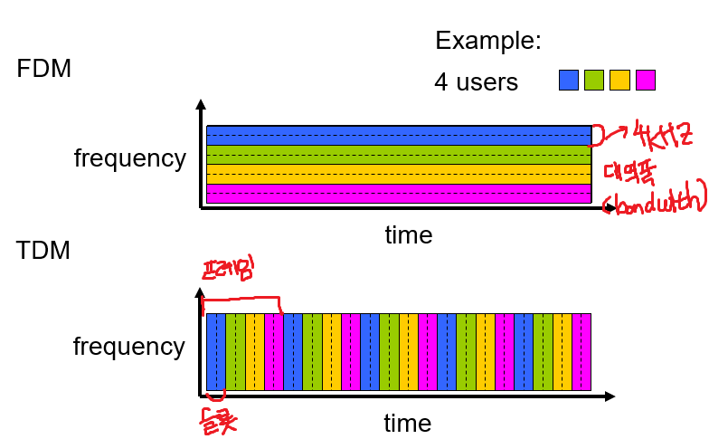
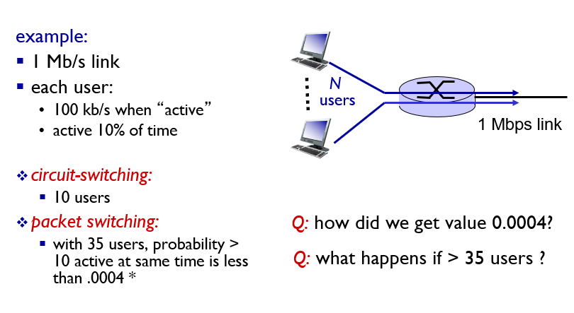

# Chapter 1 Introduction

## 1.1 What is the Internet

### 1.1.1 `nuts ans bolts view`

인터넷을 구성하는 하드웨어, 소프트웨어, 데이터 구성요소로 바라보는 관점이다. 이러한 관점에서 인터넷은 전 세계에 존재하는 수십억 개의 컴퓨팅 장치를 연결하는 네트워크이다.

host system(end system) + cable + data(packet(3계층), frame, signal ...)

호스트 시스템은 통신링크(Communication Link)와 패킷 스위치(Packet switch)로 연결되어 있다.

용어 정리 :

- bandwidth : 호스트 시스템을 연결하는 통신 링크에서 전달할 수 있는 데이터의 전송 속도. 초당 비트수(bps)로 계산한다.
- router와 packet switch : 통신 링크로 이동하는 데이터 패킷이 목적지 호스트 시스템으로 이동할 수 있도록 경로를 지정해주는 장치.
- ISP(Internet Service Provider) : 통신링크와 패킷 스위치등을 설치하여 지역 또는 국가간 네트워크 연결을 제공하는 서비스 업체(SK Broadband, AT&T 등등)
- Internet : network of networks, 인터넷 서비스 제공자(ISP)에 의해서 연결되어 있는 네트워크. 네트워크에서 가장 중요한 점은 reliablity(동일한 기능을 일정하게 제공할 수 있는 능력)
- Protocol : 인터넷에서 데이터를 교환하는 규칙. 대표적으로 TCP/IP가 존재한다.
- IETF : 인터넷 프로토콜에 대한 표준을 정하는 기구. 여기에서 특정 분야에 대한 RFC를 정한다.
- RFC

### 1.1.2 What is `protocol`

서로 소통하는 방법에 대한 규칙이다. packet에 대한 format을 지정하기도 하고, message에 대한 순서, 요청에 대한 action을 지정하기도 한다.

### 1.1.3 `service view`

어플리케이션에 서비스를 제공하는 `infrastructure`. 인터넷을 이용해서 어플리케이션과 엔드 시스템간 데이터를 주고받을 수 있도록하는 프로그래밍 interface api.

## 1.2 Network Edge

### A closer look at network structure

- network edge :
  - hosts : clients and servers
- access networks, physical media : end system을 다른 end system과 연결하는 경로상에서, 가장 첫번째로 만나게 되는 라우터(가장자리 라우터)까지의 네트워크. wired, wireless links
- network core(back bone) : access network를 연결하는 network

> `Cloud Computing` : 유비쿼터스와 비슷한 개념. 언제 어디서든지 인터넷에 연결되어 있다면 사용할 수 있는 컴퓨팅 서비스. 구름 뒤에 가려진 부분처럼, 가려진 공간에서 무언가 시스템을 설치하고 서비스를 제공해서 cloud라는 이름이 붙었다.

### 1.2.1 Access networks(접속 네트워크) and physical media

- Digital subscriber line (DSL) : 전화와 인터넷을 동시에 송수신할 수 있는 형태의 네트워크. 옛날 방식. 업로드 속도와 다운로드 속도의 차이가 존재(다운로드 > 업로드)
- Cable network : 케이블 TV를 제공하는 회선을 이용해서 인터넷도 제공하는 방식.  

cable headend에서 CMTS 까지는 광케이블, cable headend에서 cable modem까지는 동축케이블로 연결되어 있다. 2가지 종류의 케이블이 쓰여서 HGC라는 용어가 붙음. Cable modem에서 통신신호의 업스트림과 다운스트림 채널을 나눈다(업로드, 다운로드 속도가 다름).
- Home network : LAN(Local Area Network)를 이용해서 기업 또는 가정의 end system들을 한 번에 access network에 연결하는 방식. 여러가지 LAN 기술이 있지만 가장 많이 사용하는 방식은 이더넷 케이블을 이용해서 이더넷 스위치에 연결하는 것이다.  
  
가정용 라우터에 AP(Access Pointer)를 달아서 무선 네트워크(`Wifi`, `IEEE 802.11`)를 지원할 수도 있다.
- Wireless access network

### 1.2.2 물리 매체(Physical Media)

1 비트를 한 end system에서 다른 end system으로 전송한다고 했을 때, 많은 송신기-수신기 짝을 거치게 된다. 송신기-수신기 사이에는 물리 매체(Physical Media)가 있으며, 이 물리 매체 상에서 전자파나 광펄스의 형태로 전파된다.

- guide media(유도 매체) : 광섬유나 동축 케이블과 같은 견고한 매체를 통해서 신호를 유도하여 데이터를 전송하는 형태
- unguide media(비유도 매체) : 무선 LAN 혹은 디지털 위성채널처럼 모든 방향으로 신호를 보내 데이터를 전송하는 형태

물리 매체의 종류

- 꼬임 쌍선(Twisted pair) : 가장 싸고, 가장 많이 이용하는 형태. 2 개의 절연 동선이 나선 형태로 꼬아져있다. 다른 쌍선들과의 전기 간섭을 줄이기 위해 나선 형태로 꼬아놓았다.  

- 동축 케이블(coaxial cable) : 2개의 구리선이 평행하지 않고, 동심원 형태로 되어있다. 일반적으로 꼬임 쌍선보다 더 높은 데이터 전송률을 보인다. 주로 케이블 tv 업체가 인터넷 서비스도 제공할 때 사용된다. 동축 케이블은 유도 공유 매체로 사용할 수 있다. 많은 수신기가 케이블에 직접 연결 될 수 있고, 모든 종단 시스템은 다른 하나의 종단 시스템이 방출하는 신호를 수신할 수 있다.  

- 광섬유(fiber optical cable) : 비트를 나타내는 광펄스를 전송하는 가늘고 유연한 매체. 전자기장의 간섭도 없고, 초당 10GB에서 100GB에 이르는 놀라운 전송속도를 보여준다. 또한 100km까지는 신호 감쇠현상도 매우 적다. 그러나 비용이 매우 크기 때문에 주로 국가간 네트워크를 연결하는데 사용된다.
- 라디오 채널 : 전자기 스펙트럼으로 신호를 전달한다. 물리 매체가 필요없고, 벽을 관통할 수 있으며, 이동 사용자에게 연결성을 제공하고 먼 거리까지 신호를 전달할 수 있는 것이 장점이다. 그러나 신호를 전달하는 환경(다른 라디오 전파의 간섭, 물체에 의한 방해)에 따라서 영향을 받을 수 있다.  
1~2m의 매우 짧은 거리에 동작하는 채널, 10에서 수백m에 걸쳐 근거리 네트워크로 동작하는 채널, 수십km에 걸쳐 광역에서 작동하는 채널, 위성 라디오 채널 등이 있다.

## 1.2 네트워크 코어(Network Core)

엔드 시스템을 연결하는 패킷 스위치와 네트워크 링크

### 1.3.1 패킷 교환

하나의 end system에서 다른 end system으로 데이터를 전송할 때 어플리케이션 레벨에서 메시지를 주고 받는다. 이 메시지는 서로간의 동작을 제어하는 컨트롤일 수도 있고, jpeg, mp3와 같은 파일을 포함할 수 있다. 송신 end system에서 메시지를 수신 end system으로 보내기 위해, 송신 시스템은 긴 애플리케이션 layer 메시지를 패킷(packet)이라고 하는 작은 단위로 나누다. 각 패킷은 통신링크와 패킷 스위치를 거치게 된다. 패킷은 링크의 최대 전송속도로 통신 링크상에서 전송된다. 따라서 R bit/sec를 갖는 통신링크 상에서 L bits의 패킷을 전송할때 총 L/R sec 의 시간이 소요된다.  

### `저장-후-전달`

대부분의 패킷 스위치는 패킷을 전달할 때 `저장-후-전달` 방식을 사용한다. 즉, 하나의 패킷에 있는 비트를 전송받으면 곧바로 다른 링크로 해당 비트를 전송할 수 있는 것이 아니라, 완전한 패킷이 스위치에 전송될때까지 기다린 다음 비트를 전송할 수 있음을 의미한다.  

패킷을 저장한 뒤 전송하는 과정에서 딜레이가 발생한다. R bit/sec의 bandwidth를 갖는 N개의 링크로 구성된 네트워크에서 길이 L bits의 패킷을 전송하는데 걸리는 지연시간은 다음과 같다.  
$$
delay = N{L \over R}
$$

### `큐잉 지연과 패킷 손실`

패킷 스위치에는 여러 링크가 연결되어 있다. 패킷 스위치는 각 링크에 대해서 출력 버퍼(출력 큐)를 가지고 있다. 도착하는 패킷이 링크를 통해서 전송되려고 할때 해당 링크가 이미 다른 패킷을 전송하고 있다면 패킷은 출력 버퍼에 저장될 필요가 있다. 이 과정에서 `저장-후-전달`에 더하여 `큐잉 지연`이 발생한다.  

위 그림에서 짧은 기간동안 라우터에 도착하는 패킷의 전송 속도가 1.5Mbps를 초과하게 되면 패킷은 출력 버퍼에 큐잉된다.  
버퍼의 크기는 유한하기 때문에 만약 출력 버퍼가 가득찬 상황에서 해당 링크로 패킷이 도착하게 되면 해당 패킷 또는 버퍼에 있던 패킷이 손실될 수 있다(`패킷 손실`)

### `전달 테이블`과 `라우팅 프로토콜`

라우터에 접속된 여러 통신링크 중 하나에서 오는 패킷을 어떻게 목적지로 향하는 다른 통신링크로 전달하는 가에 대해서 알아보자.  
인터넷에 연결된 모든 end system은 IP 주소를 가지고 있다. 송신 end system에서 수신 end system으로 패킷을 전송할 때 수신 시스템에 대한 IP 주소를 패킷의 헤더에 포함시킨다. 패킷을 수신한 라우터는 헤더에 존재하는 IP 주소를 활용한다. IP 주소는 우편 주소처럼 계층이 존재(예를 들어 인천광역시 / 남구 / 인주대로)하는데, 라우터는 내부의 전달 테이블(forwarding table)을 가지고 있어서 특정 IP의 특정 계층에 대한 전달 링크를 맵핑하여 관리한다. 이를 통해 패킷을 적절한 링크로 다시 전송할 수 있다.  
  
여기서 다시 어떻게 라우터에 전달 테이블을 설정할 것인가에 대한 의문이 남는다. 인터넷은 자동으로 라우터에 전달 테이블을 설정하는 `라우팅 프로토콜`을 갖는다. 이는 나중에 알아본다.

### 1.3.2 회선 교환(Circuit Switch)

링크와 스위치로 연결된 네트워크에서 데이터를 이동시는 방식에는 패킷 교환과 회선 교환의 2가지 방식이 존재한다.

### `회선 교환(Circuit Switch)`

회선 교환 방식에서 두 개의 end system이 통신하기 위해서는 링크자원(버퍼, 링크 전송률)이 통신세션(session)간에 예약된다. 패킷 교환 방식은 링크 자원을 예약하지 않는다. 이러한 방식을 사용하는 대표적인 예가 `전화망`이다. 전화망을 통해 송신자와 수신자가 통화를 하려고 할때, 네트워크 스위치들은 해당 연결 상태를 유지해야 한다. 이러한 연결을 정보통신 용어로 `회선(Circuit)`이라고 한다. 네트워크가 회선을 설정할 때, 그 연결이 이루어지는 동안 네트워크 링크에 일정한 전송률을 예약한다. 주어진 전송속도가 송신자-수신자 연결을 위해 예약되므로, 송신자는 보장된 일정 전송률로 데이터를 보낼 수 있다.  
이와 달리 패킷 교환 방식에서는 송신자가 보낸 패킷이 전송될 때 링크의 자원(회선)을 예약하지 않는다. 패킷이 전송될 링크가 혼잡하다면 출력 버퍼에 패킷이 저장 될 수 있으며, 이 과정에서 지연이 발생한다. 따라서 보장된 속도로 패킷이 전송되지 않을 수 있다.

### 회선 교환 네트워크에서 다중화

링크 내의 한 회선은 `주파수-분할 다중화(Frequency-division multiplexing, FDM)`와 `시-분할 다중화(Time-division multiplexing, TDM)`으로 구현된다.  

FDM에서 링크에서 설정된 회선에 대해 특정 주파수 대역을 예약한다. 주로 4kHz 폭의 주파수 대역을 고정 제공한다. 이러한 폭을 `대역폭(bandwidth)` 라고 한다.  
TDM에서는 시간을 일정한 `프레임`으로 나누고, 각 프레임을 다시 일정한 `슬롯`으로 나눈다. 하나의 회선에 대해서 특정 슬롯 동안의 전체 주파수 대역폭을 고정해서 사용할 수 있게 해준다. 모든 프레임에서 해당 슬롯을 특정 연결에 할당한다.  
이 방식의 단점은 회선이 사용되지 않는 idle time에 자원을 낭비하게 된다는 것이다. 또한 종단간 회선을 설정하고 대역폭을 유지하는 것이 복잡하고, 스위치간 운영을 조절하는 복잡한 소프트웨어가 필요하다.

### `패킷 교환` 대 `회선 교환`

다음과 같은 예를 보자. 각 인터넷 사용자가 1 Mbps의 링크를 공유한다고 하자. 각 사용자는 활동시간과 비활동시간을 번갈아가며 나타내며 활동시간은 전체 시간의 10%이다. 활동시간에는 100kbps의 속도로 데이터를 생산해낸다고 하자.  
회선교환 방식은 링크의 자원을 예약해야하기 때문에 동시에 최대 10명의 사용자만이 인터넷을 사용할 수 있다. 회선이 연결되어 있는 동안 사용자가 사용을 하든 안하든 간에 해당 회선은 연결이 끝날때까지 유지되어야 하며 이는 자원낭비이다.  
패킷 교환 방식의 경우 만약 전체 사용자가 35명일 때 11명 이상의 사용자가 동시에 인터넷을 사용할 확률은 0.0004이다. 때문에 패킷 교환 방식은 회선 교환 방식에 비교해서 거의 동일한 수준의 딜레이를 발생시키면서 더 적은 비용으로 네트워크를 구성할 수 있으며 동시에 더 많은 사람들이 사용할 수 있게 된다.(패킷 교환 방식의 구축 비용이 더 적기 때문에)

### 1.3.3 네트워크의 네트워크

