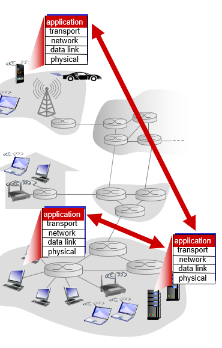
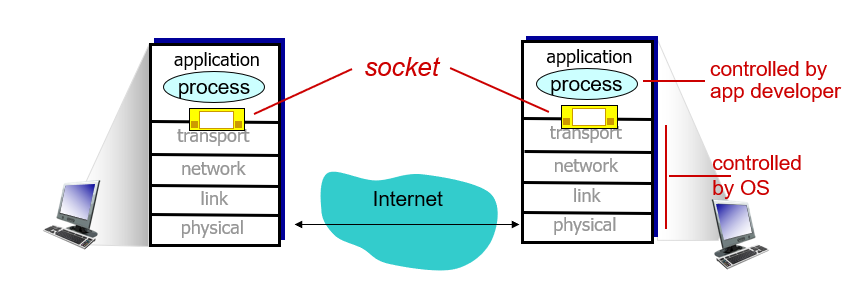

# Chapter 2 애플리케이션 계층

## 2.1 네트워크 애플리케이션의 원리

네트워크 애플리케이션을 개발하는 상황을 생각해보자. 네트워크 애플리케이션은 여러 종단 시스템에 분리되어 있을 수 있다. 예를 들어 웹 서버가 웹 애플리케이션 서비스를 제공하고, 클라이언트에서는 웹 브라우저를 통해서 해당 서비스를 이용하게 할 수 있다.

이러한 네트워크 애플리케이션은 애플리케이션 계층에서의 개발만 신경쓰면 된다. 네트워크 코어에 대한 개발을 필요치 않으며 그렇게 할 수도 없다. 종단 시스템에서면 애플리케이션이 존재할 수 있다는 개념이 빠르고 광범위한 애플리케이션 발전의 원동력이 되었다.

### 2.1.1 네트워크 애플리케이션 구조

- **클라이언트-서버 모델** : 항상 켜저 있는 호스트 시스템(서버)에 가끔 또는 항상 커져있는 호스트 시스템(클라이언트)가 요청을 보내는 구조. 웹 애플리케이션이 그 예이다. 클라이언트가 브라우저를 통해 서버에 객체를 요청하면, 서버는 해당 객체를 응답한다. 서버에는 고정IP가 부여되어 있다. 클라이언트끼리는 직접 통신하지 않는다. 인기있는 서비스의 경우 많은 트래픽을 처리하기 위해 하나의 호스트로 서버를 구성하지 않고 많은 서버를 가지고 있는 데이터 센터를 운영할 수 있다.
- **P2P (Peer-to-Peer) 모델** : P2P 모델에서는 서버를 조금 또는 완전히 의존하지 않을 수 있다. 각 호스트는 서버가 아니라 간헐적으로 연결되어 있는 다른 호스트(peer)와 연결된다. 이들 호스트는 서버가 소유하지 않는다. 하나의 호스트는 다른 호스트로 요청을 할 수 있을 뿐만 아니라, 다른 호스트에 서비스를 제공하는 역할까지 한다. 비트토렌트같은 프로그램이 그 예이다. P2P 모델의 가장 큰 특징은 자가 확장성(self scalability)이다. 즉 새로운 사용자가 등장하면 그에 따라서 서비스 용량과 서비스 요청이 함께 증가한다. 이 모델은 클라이언트-서버 모델과는 다르게 서버 시스템 구축에 대한 비용이 들지 않는다. 대신 많은 수의 호스트에 분산되어 있는 시스템에 대한 보안, 성능, 신뢰성 문제에 직면하고 있다.

### 2.1.2 프로세스 간 통신

운영체제에서 실제로 통신하는 것은 프로그램이 아니라 프로세스(process)이다. 한 호스트내에서 프로세스끼리의 통신은 운영체제별로 다르다. 그보다 우리는 네트워크에 연결된 프로세스간의 통신에 관심이 있다. 이들 프로세스는 애플리케이션 계층에서 메시지 형태로 통신을 한다.

#### 클라이언트와 서버 프로세스

네트워크에서 메시지를 주고 받는 프로세스는 `클라이언트`와 `서버` 둘 중 하나로 이름 지을 수 있다. 일반적으로 요청을 하는 입장을 `클라이언트`, 요청을 받는 입장을 `서버`라고 할수 있다. 다음과 같이 정의할 수도 있다.

> 두 프로세스 간의 통신 세션에서 통신을 초기화(다른 프로세스와 세션을 시작하기 위해서 접속을 초기화)하는 프로세스를 클라이언트라 하고, 세션을 시작하기 위해 접속을 기다리는 프로세스를 서버라고 한다.

P2P 모델에서 호스트는 클라이언트와 서버 2 역할을 모두 수행할 수 있다. 통신 세션이 시작할때 데이터를 받는 쪽을 클라이언트, 보내는 쪽을 서버라고 부른다.

#### 프로세스와 컴퓨터 네트워크 사이의 인터페이스

프로세스는 컴퓨터 네트워크를 통해 메시지를 다른 호스트 시스템에 있는 프로세스에 전송한다. 이 전송은 애플리케이션 계층에서 이루어지며 그 하위 계층(트랜스포트) 계층에서 제공하는 서비스를 사용한다. 애플리케이션 계층에서 트랜스포트 계층의 서비스를 사용하기 위한 일종의 인터페이스로서 소켓(socket)이 존재한다. 이 소켓은 어플리케이션 계층에서 사용할 수 있는 네트워크 서비스에 대한 API라고도 할 수 있다. 애플리케이션 개발자는 소켓의 애플리케이션 부분에 대한 통제권을 갖지만, 트랜스포트 계층에 대한 통제권은 거의 갖지 못한다. 만약 가능하다면 프로토콜(TCP, UDP) 선택이나 해당 프로토콜에서 사용하는 버퍼 크기 정도를 인자로 전달할 수 있을 뿐이다.  

#### 프로세스 주소

한 호스트에서는 여러개의 네트워크 프로세스가 실행될 수 있다. 따라서 호스트에 메시지를 전달하기 위해서는 해당 호스트를 식별하는 주소(IP 주소) 뿐만 아니라 프로세스 식별을 위한 번호(정확히는 소켓을 식별하기 위한), 포트번호(Port)가 필요하다.
