# Ch04 네트워크 계층 : 데이터 평면

4장에서의 목표 : 네트워크 계층에서 일어나는 일들과 원리를 알아본다.

- forwarding, routing
- how a router works
- broadcast, multicast

## 4.1 네트워크 계층 개요

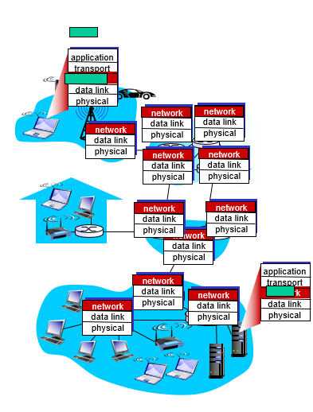

네트워크 계층(Network Layer)는 호스트 간에 트랜스포트 계층 세크먼트를 송수신하는 서비스를 제공한다. sender host는 상위 트랜스포트 계층 세그먼트에 네트워크 계층 헤더를 붙이고, 캡슐화하여 데이터그램(Datagram, 네트워크 계층 패킷)을 생성하고, 전달한다. receiver host는 도착한 Datagram에서 트랜스포트 세그먼트를 추출하여, 상위 트랜스포트 계층에 전달한다.

네트워크 계층은 end-system 뿐만 아니라, 네트워크 코어에 존재하는 라우터 장비가 관여된 시스템이다. 라우터에는 3계층(네트워크 계층)까지 존재하고, 트랜스포트 계층이나, 어플리케이션 계층은 존재하지 않는다.

### 4.1.1 포워딩과 라우팅 : 데이터 평면과 제어 평면

라우터에서는 2가지 중요한 기능이 있는데, 포워딩(forwarding)과 라우팅(routing)이다.

**포워딩(forwarding)** 은 라우터의 입력포트로 들어온 패킷을 목적지로 보낼 수 있도록 적절한 라우터 출력포트로 보내는 작업이다. 라우터에는 포워딩 테이블(forwarding table)을 관리한다. 데이터그램 헤더에 설정된 수신자의 주소가 이 포워딩 테이블의 인덱스로 사용된다. 해당 인덱스에 대응하는 entry에는 그 패킷이 이동해야할 라우터의 외부 링크 인터페이스를 나타낸다. 포워딩은 주로 나노초(ns) 단위로 수행되며 하드웨어를 통해서 수행된다. 포워딩은 네트워크 계층의 데이터 평면에서 수행된다.

**라우팅(routing)** 은 송신자에서 수신자로 데이터 그램이 이동할 경로를 결정하는 알고리즘이다. 라우팅 알고리즘은 각 라우터의 포워딩 테이블을 적절히 결정한다. 이 때 전통적인 방법으로 라우터간 라우팅 프로토콜(routing protocol)을 이용하여 서로 소통하면서 포워딩 테이블을 구성할 수 있다. 다른 방법으로는 각 라우터에 연결되어 있는 원격 네트워크가 라우터의 포워딩 테이블을 구성할 수 있다(SDN). 라우팅 알고리즘은 밀리초(ms)에서 초(s)단위로 수행되며, 소프트웨어를 통해서 수행된다. 라우팅은 네트워크 계층의 제어 평면에서 수행된다.

### 4.1.2 네트워크 서비스 모델

네트워크 서비스 모델은 송수신 호스트간 패킷 전송 특성을 정의한다. 네트워크 계층에서 제공할 수 있는 서비스들에는 어떤것들이 있을까?

- 패킷 전송을 보장 (보장된 전송)
- 패킷이 특정 시간 이내로 전송될 것을 보장 (지연 제한 이내의 보장된 전달)
- 여러 패킷이 전송될 때, 순서대로 전송될 것을 보장 (순서화 패킷 전달)
- 송신과 수신 호스트 사이에 특정한 비스 속도의 전송 링크를 애뮬레이트 (최소 대역폭 보장)

인터넷 네트워크 계층은 최선형 전달 서비스(best-effort) 방식을 사용한다. 이는 패킷이 수신자로 전달되는 것을 보장하지 않는다(패킷 손실 가능). 또한 여러 패킷을 전송할 경우, 패킷의 순서가 지켜지지 않을 수 있다. 보장된 최소 대역폭 또한 없다. 그러나 최선형 전달 서비스만으로도 충분히 좋은 네트워크 계층 서비스가 가능하다는 것이 알려져있다.

## 4.2 Virtual Circuit and Datagram networks

트랜스포트 계층의 TCP와 UDP 처럼 네트워크 계층에서도 데이터를 전송할때 호스트간의 연결(Connection) 여부에 따라서 Datagram Network, Virtual Connection Network로 나눌 수 있다.

### Virtual Connection Network

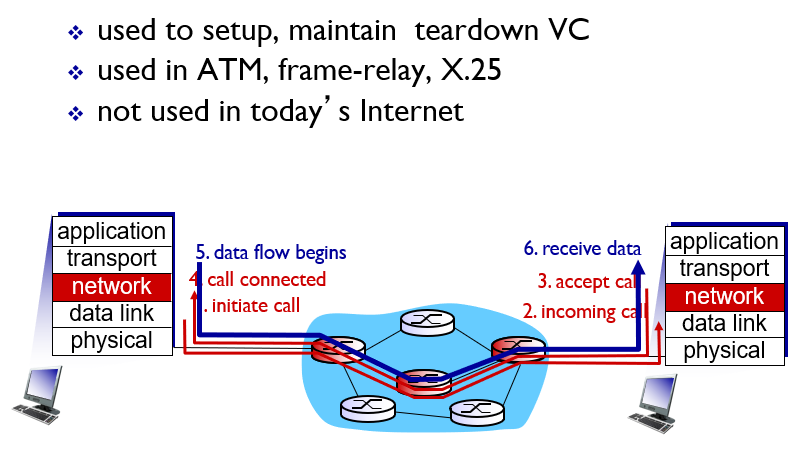

TCP 처럼 두 호스트가 데이터를 송수신하기 전에 미리 어떤 연결(Connection)을 설정하는 과정이 있다. Virtual Connection은 연결과정에서 두 호스트가 데이터를 송수신하는 경로(path), 이 경로 상에 존재하는 라우터들(Router)를 확정한다. 데이터를 송수신하기 전에 연결과정을 거쳐야 하는 오버헤드가 존재하지만, 한번 연결이 되면 경로상에 존재하는 라우터 자원들이 하나의 연결에 할당되어 predictable한 서비스가 가능하다. 또한 패킷 전송 순서가 일정하게 유지되는 등의 장점이 있다. VC 상의 패킷은 목적지 주소 대신 VC number라는 것을 관리한다. 이 VC number에 대응하는 출력포트를 포워딩 테이블로 관리한다. 또한 각 라우터에는 입력 포트와 출력 포트의 연결에 대한 `state`를 관리한다.

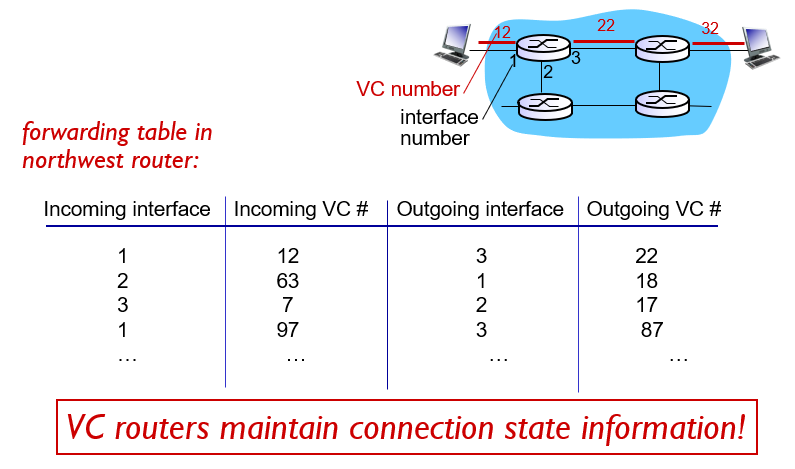

전화 시스템에서 발달된 형태이다. 호스트 사이의 네트워크에 많은 기능을 구현하고, 호스트 시스템은 간단한 기능만을 수행한다. (**dumb endsystem**)

### Datagram Networks

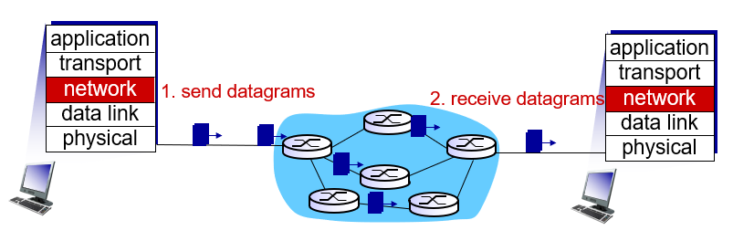

패킷 헤더에 설정된 목적지의 주소를 가지고 라우터에서 나갈 출력 포트를 결정한다. 두 호스트가 통신하기 전에 연결과정이 필요하지 않다.

호스트 사이의 데이터 송수신간 많은 부분을 호스트 시스템에서 구현한다. (**smart endsystem**)

## 4.3 라우터 내부 구조

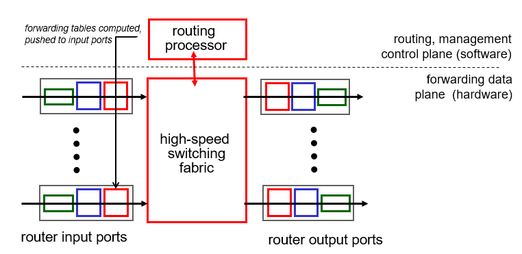

- **입력 포트** : 입력포트는 다음과 같은 3가지 부분으로 구성되어 있다. 입력포트의 반대편 라우터에서부터 연결되는 링크 신호 송수신에 사용되는 물리 계층 프로토콜(phsical layer protocol), 중간에 링크 계층 프로토콜(link layer protocol)이 있다. 가장 중요한 부분은 맨 오른쪽에 빨간색 상자로 표현된다. 이곳에서는 어떤 출력포트로 패킷을 전송할 것인지를 **검색** 하는 네트워크 계층 구성요소로 되어 있다. 이곳에서 포워딩 테이블을 참조하여 도착된 패킷이 스위칭 구조를 통해 전달되는 라우팅 출력 포트를 결정한다. 제어 패킷은 입력포트에서 라우팅 프로세서로 전달된다.
- **스위치 구조** : 스위칭 구조는 라우터의 입력포트와 출력 포트를 연결한다.
- **출력 포트** : 출력포트에서는 입력포트로부터 받은 데이터그램을 저장할 네트워크 계층 구성요소, 링크 계층, 물리 계층 구성요소가 존재한다. 링크가 양방향일 때, 출력포트는 일반적으로 동일한 링크의 입력포트와 한 쌍을 이룬다.
- **라우팅 프로세서** : 제어 평면 기능을 수행한다. 라우터들과 라우팅 프로토콜을 수행하여 포워딩 테이블을 수정한다. 또는 SDN의 경우 원격 컨트롤러에서 계산된 포워딩 테이블 항목을 수신하고 라우터의 입력 포트에 이러한 항목을 설치한다. 또 네트워크 관리 기능을 수행한다.

### 4.3.1 입력 포트 처리 및 목적지 기반 전달

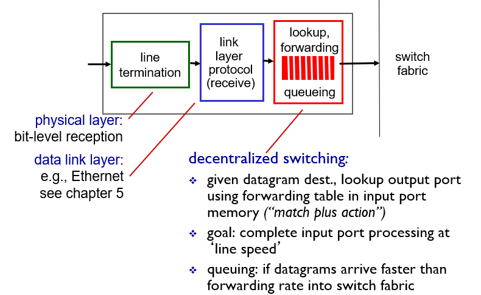

### 포워딩 테이블

입력 포트에서 들어온 패킷을 어떤 출력 포트로 보낼 것인지 검색하는 것이 라우터 동작의 핵심이다. 이때 포워딩 테이블을 이용한다. 포워딩 테이블은 라우터 프로세서에 의해 계산되거나, 원격 SDN 컨트롤러에서 수신된다. 포워딩 테이블은 각 입력 회선으로 복사되어 각 입력회선에서 분산적으로 사용된다.

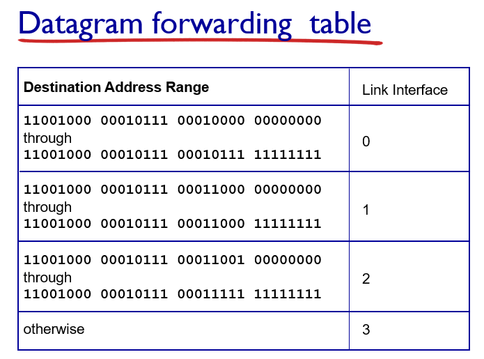

포워딩 테이블의 인덱스는 어떻게 결정될까? 일반적으로 사용하는 IPv4 주소는 32bit로 구성되어있다. 가능한 모든 ip에 대해서 엔트리를 생성하려면 40억개 이상의 엔트리가 필요하기 때문에 현실적으로 불가능하다. 대신 특정 ip 주소 범위를 하나의 entry에 대응시킨다.

#### Longest prefix matching

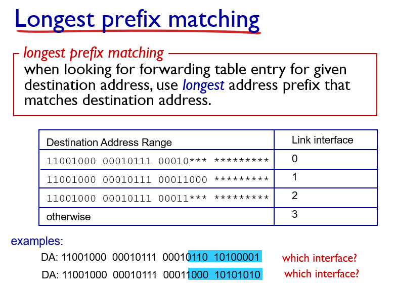

입력포트로 들어온 패킷의 주소를 포워딩 테이블과 매칭시켜 비교할 때 Longest prefix matching 기법을 사용한다. ip 주소의 prefix 부분을 테이블 인덱스와 비교하여 가장 길게 match되는 인덱스의 엔트리를 사용한다.

## 4.3.2 변환기

### 스위치 구조 (Switching fabric)

라우터 내부에서는 어떻게 입력포트로 들어온 패킷을 출력포트로 전송하는가? 다음과 같은 3가지 방법이 존재한다.

- 메모리 구조 (memory)
- 버스 구조 (bus)
- 크로스바 구조 (interconnection cross bar)

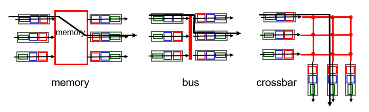

#### 메모리 구조

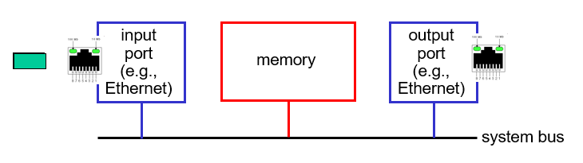

입력 포트에서 패킷이 들어오면 라우터 프로세서에 인터럽트 방식으로 이를 알리고 시스템 메모리에 패킷을 저장한다. 라우터 프로세서는 헤더에서 대상 주소를 추출하고 포워딩 테이블에서 적절한 출력 포트를 찾은 다음 시스템 메모리에 저장되어 있는 패킷을 출력 포트로 저장한다.

메모리 대역폭이 초당 최대 B인 패킷을 메모리에 쓰거나 읽을 수 있는 경우 전체 전달 처리량은 B/2 보다 작아야한다. 또한 목적지 포트가 다른 경우라도 공유 시스템 버스를 통해 한 번에 하나의 메모리 읽기/쓰기 작업을 수행할 수 있기 때문에 두 패킷을 동시에 전달할 수 없다.

#### 버스 구조

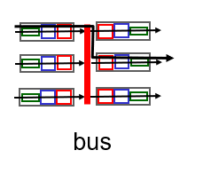

입력 포트에서 패킷이 들어오면 라우팅 프로세서의 개입 없이 버스를 통해서 바로 출력 포트로 전송한다. 입력 포트 스위치 내부 라벨이 로컬 출력 포트를 나타내는 패킷에게 전송되거나, 버스에 패킷을 전송하여 수행된다. 모든 출력 포트에 패킷이 수신되지만 라벨과 일치하는 포트만 패킷을 유지한다. 동시에 여러 패킷이 다른 입력 포트로 도착하면 한번에 하나의 패킷만 버스를 통과할 수 있기 때문에 하나를 제외한 모든 패킷이 대기해야한다.

#### 크로스바 구조

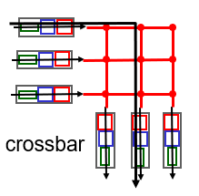

입력포트에서 나오는 버스들과 출력포트로 들어가는 버스들을 서로 연결(interconnection)한다. 이 교차점은 스위치 구조 컨트롤러에 의해 언제든지 열거나 닫혀질 수 있다. 적절한 상황에서 각 입력포트의 패킷이 각각의 출력 포트로 동시에 전송될 수 있게 하였다. 그러나 서로 다른 입력포트에 들어온 패킷이 동일한 출력 포트로 향하는 경우 한 패킷은 여전히 대기해야한다.

### 4.3.3 출력 포트 프로세싱

출력 포트 프로세싱은 출력 포트의 메모리에 저장된 패킷을 가져와서 출력 링크를 통해 전송한다.

### 4.3.4 어디서 큐잉이 일어날까

패킷 큐는 입력 포트와 출력 포트 모두에서 형성 될 수 있다. 대기열의 위치와 범위는 트래픽 로드, 스위칭 구조의 상대 속도 및 회선 속도에 따라서 달라진다. 이 대기열이 더 커지면 라우터의 메모리가 결국 소모될 수 있고 도착하는 패킷을 저장할 수 있는 메모리가 없을 때 패킷 손실이 발생한다.

여기서는 입력 및 출력 회선의 속도는 모두 초당 Rline 패킷으로 동일한 전송 속도를 가지고 있고, N개의 입력포트와 N개의 출력 포트가 있다고 하자. 단순화를 위해 모든 패킷의 고정 길이가 같다고 하자. 또한 패킷을 송신하는 시간은 임의의 링크 상에서 패킷을 수신하는 시간과 동일하고, 그러한 시간 간격 동안 0 또는 하나의 패킷이 입력 링크 상에 도착할 수 있다. 패킷이 입력 포트에서 출력 포트로 이동할 수 있는 속도로 스위칭 구조 전송속도는 Rswitch로 정의한다. 만약 Rswitch가 Rline보다 N 배 빠르다면 입력 포트에서 발생하는 큐들은 무시한다. N개의 패킷들이 입력 포트로 들어온다고 하더라도, 다음번 패킷이 도착하기 전까지 N 패킷들의 배치작업이 모두 처리될 수 있기 때문이다.

#### 입력 포트에서의 큐잉

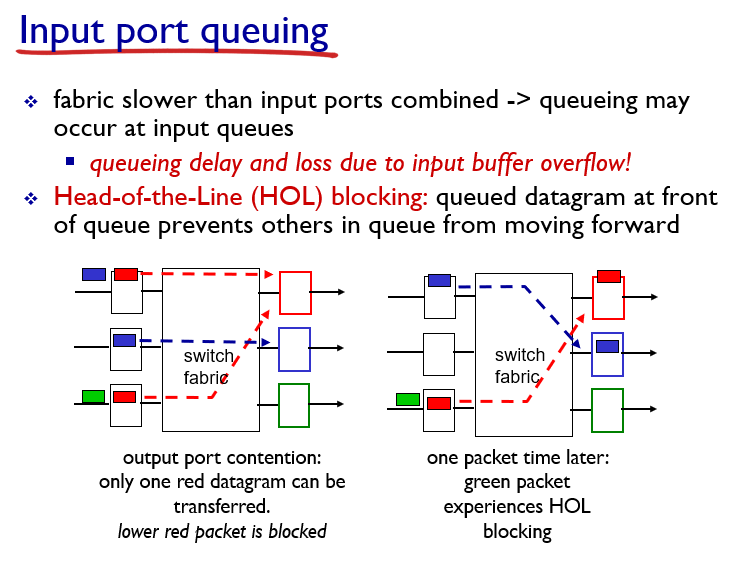

입력포트가 총 N개가 있고, 스위치 구조는 크로스바 형태라고 가정하자. 여기서 스위치 구조의 성능은 하나의 입력포트 성능의 N배가 아니라고 하자.

어느 한 시점에서 두 개의 입력포트가 동일한 하나의 출력 포트로 패킷을 전달한다고 가정해보자. 두 개의 입력포트 중 한 입력포트의 패킷은 다른 입력포트의 패킷이 모두 출력 포트로 전송될 때까지(다음 시간 단위까지) 대기해야 한다.

또한 대기해야 하는 패킷 뒤에 있는 패킷(초록색)은 다음 시점에서는 현재 대기하고 있는 패킷이 없다면 아무런 경쟁없이 바로 출력포트로 전송될 수 있는 패킷이다. 이렇게 입력포트 큐의 맨 앞쪽에서 대기하고 있는 패킷 때문에 뒤쪽 패킷의 전송이 차단되는 것을 **head of line** 차단이라고 한다.

### 출력 포트에서의 큐잉

이번에는 스위치 구조의 성능이 입력 포트 성능의 N배라고 하자. 이런 경우에도 출력 포트에서는 큐잉이 발생할 수 있다. N개의 모든 입력포트에서 동일한 출력 포트로 패킷을 전달하는 경우를 생각해보자. 한 시간단위에서 출력 포트는 하나의 패킷만을 전송할 수 있다. 나머지 N-1개의 패킷은 출력 포트의 버퍼에 저장되게 된다.

출력 포트 버퍼에서 어느 패킷이 먼저 전송될 것인가에 대한 큐칙은 보통 FCFS(또는 FIFO으로 표현) 방식으로 전달되며, 우선순위 방식, 라운드 로빈 방식 등 다른 방법들도 사용될 수 있다.

### 얼마나 큰 버퍼가 필요할까

버퍼링의 양(B)은 평균 왕복 시간(RTT)에 링크 용량(C)를 곱한뒤, flow의 개수(N)으로 나눈 것을 사용한다.

$$
B = {RTT \cdot C} \over \sqrt{N}
$$

## 4.4 인터넷 프로토콜(IP): IPv4, 주소 지정, IPv6 등

### 4.4.1 IPv4 데이터그램 형식

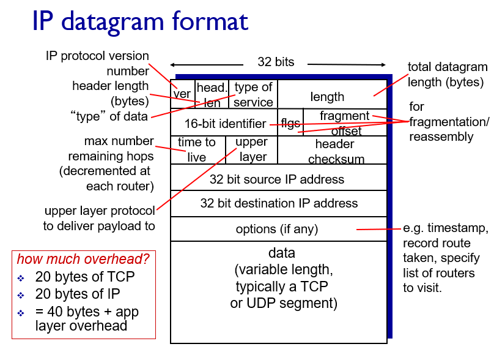

- **IP version(4 bit)** : 데이터그램의 IP 버전을 명시한다. 이 값에 따라서 나머지 헤더를 어떻게 해석할 것인지 결정한다.
- **헤더 길이(4 bit)** : IPv4 데이터그램은 가변길이 옵션을 포함하고 있기 때문에 헤더 길이를 통해서 실제 페이로드가 시작되는 위치를 나타낸다(32비트 워드단위?).
- **서비스 타입(8 bit)** : 서로 다른 유형의 IP 데이터그램을 구별한다.
- **데이터 그램 길이(16 bit)** : 바이트로 계산한 IP 데이터그램의 총 크기(헤더 + 데이터).
- **식별자, 플래그, 단편화 오프셋** : IP 단편화와 관련된 필드들.
- **TTL(Time-to-live)** : 인터넷에서 데이터 그램이 무한히 순환하지 않도록 한다. 라우터가 데이터그램을 처리할 때마다 이 필드의 값이 하나씩 줄어든다. 이 필드가 0이 되면 해당 데이터그램은 폐기된다.
- **프로토콜(upper layer)** : 상위 계층(트랜스포트 계층)에서 어떤 프로토콜에게(TCP 또는 UDP) 전달할지 결정하는 필드. 이 필드는 일반적으로 데이터그램이 최종 목적지에 전달 되었을 경우에만 사용된다.
- **헤더 체크섬** : IP 헤더 필드들을 16bit 단위로 더한다음, 더한값의 1의 보수값을 저장한다. 데이터그램이 라우터에 도착할때마다 헤더 체크섬을 계산하여 비교한다. 만약 체크섬이 일치하지 않는다면 데이터그램은 폐기된다. 라우터를 거치게 될때마다 TTL 값이 변경되기 때문에 헤더 체크섬은 매번 재계산되고 저장되어야 한다.
- **32bit 목적지, 송신지 ip 주소**
- **옵션** : 옵션 필드는 IP 헤더를 확장한다. 보통은 옵션 필드값을 채우지 않고 IP 헤더가 20바이트가 되도록 한다. 옵션 필드가 존재하면 초기에 데이터 필드 시작위치를 계산하는 것을 복잡하게 만들고, 라우터에서 데이터 그램 처리 속도를 느리게 만든다. 이러한 이유로 IPv6에서는 옵션을 포함하지 않는다.
- **데이터(페이로드)** : 목적지에 전달하기 위한 전송계층 세그먼트(TCP, UDP). 또는 특별한 유형의 데이터(ICMP 메시지)를 담기도 한다.

### 4.4.2 IPv4 데이터 그램 파편화(fragment)와 재결합(reassembly)

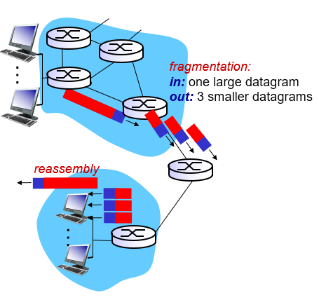

라우터와 라우터를 연결하는 링크들은 다양한 링크 프로토콜을 사용할 수 있다. 이러한 링크의 종류에 따라서 한번에 보낼 수 있는 데이터의 사이즈가 제한되는데 이를 MTU(Maximum Transmission Unit)라고 한다. 한 라우터에서 데이터 그램을 전송하고자 할때, 사용할 링크의 MTT보다 데이터 그램 크기가 클 수 있다. 이때 데이터 그램을 여러개의 파편(fragment)로 나누어서 여러 프레임(링크 계층 패킷 용어)을 생성한 뒤 보내진다.

한번 여러개의 프레임으로 파편화된 데이터 그램은 오직 end system에서만 재조합(reassembly)된다.

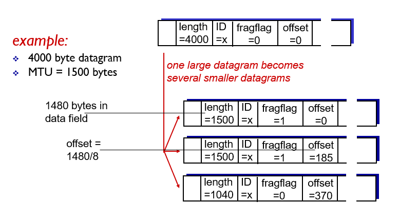

그럼 어떻게 큰 데이터 그램을 조그만한 프레임들로 나누고, 다시 end system에서 복구할까? 이는 데이터 그램 헤더의 offset, flag, index 필드를 통해서 구현된다. 파편화된 데이터 그램들은 모두 같은 index 필드를 갖고 있다. flag 비트는 이 데이터 그램이 파편화 되어 있고, 이 데이터 그램 뒤에 연결되어 있는 파편이 존재함을 알려준다. offset은 해당 데이터 그램이 원래 데이터 그램에서 어느 위치에 있었는지를 알려준다.

### 4.4v.3 IPv4 주소체계

## 자료 출처

All material copyright 1996-2012  
J.F Kurose and K.W. Ross, All Rights Reserved
