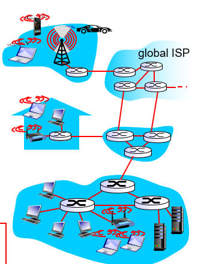
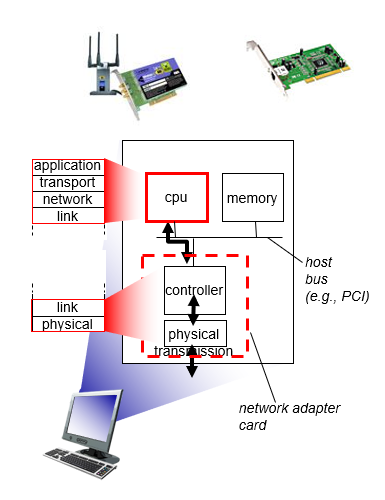
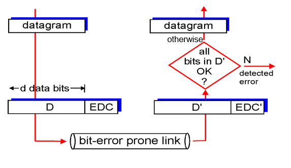
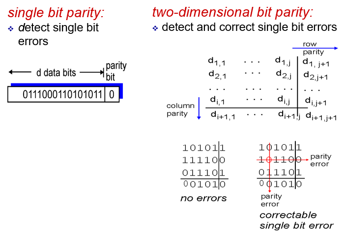
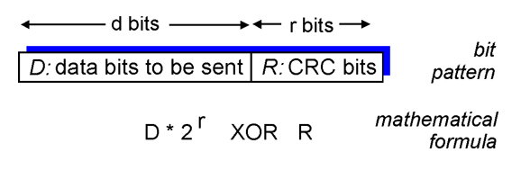
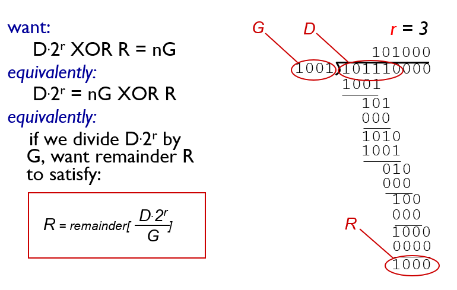

# Ch06 링크 계층

ch05 네트워크 계층에서는 한 호스트에서 네트워크로 연결된 다른 호스트로 데이터그램을 어떻게 이동시키는지에 대해서 배웠다. ch06 링크 계층에서는 한 호스트에서 링크로 연결된 다른 호스트 또는 라우터로 데이터를 전송하는 것과 같이 링크 계층에서 제공하는 서비스들에 대해서 배우게 된다. 여기에는 네트워크 계층으로부터 전달받은 데이터그램을 어떻게 링크 계층의 헤더 필드를 붙여서 프레임로 만드는지, 프레임 내의 오류 검출 방법이 있는지, 브로드캐스트 채널에서 전송 충돌을 어떻게 해결하는지, 라우터와 스위치의 차이는 무엇인지, 링크 계층에서 사용하는 주소가 있는지, 있다면 이 주소를 어떻게 확인하고 사용하는지 등에 대해서 배운다.

링크 계층 채널에는 2가지 종류가 있다. **브로드캐스트 채널**을 통한 링크 전달은 무선랜, 위성 네트워크, HFC 등이 있으며 접속망에서 다수의 호스트를 연결해준다. 이 채널을 통해 데이터를 전달하기 위해서는 여러 호스트로부터의 신호가 엉키지 않도록 하는 프로토콜이 필요할 수 있다. 이런 프로토콜을 매체접속프로토콜(medium accesss protocol)이라고 한다.

또 하나의 종류는 호스트와 다른 호스트 또는 호스트와 라우터, 라우터와 라우터가 물리 링크를 통해 1대1로 연결되어 있는 **점대점 링크**(Point to Point link)가 있다.

마지막으로 링크 계층이 구현된 기술들에 대해서 살펴본다.

## 6.1 링크 계층 소개

먼저 몇가지 용어를 소개한다. 링크 계층에서는 네트워크에 연결된 호스트 또는 라우터 등을 **노드(Node)** 라고 부른다. 또 통신 경로상의 인접한 노드들을 연결하는 통신 채널은 **링크(Link)** 라고 부른다. 링크 계층에서는 네트워크 계층으로부터 데이터그램을 받고, 여기에 링크 계층에서 쓰이는 헤더 필드를 덧붙여 **프레임(Frame)** 이라는 링크 계층 데이터 전송단위로 캡슐화한다.

링크 계층의 역할은 한 노드에서 링크를 통해 물리적으로 인접한 다른 노드에게 데이터그램을 전달하는 일이다. 데이터그램은 여러 링크를 거쳐 다른 노드로 이동하게 되며 각 링크에서는 각기 다른 링크 계층 프로토콜을 사용할 수 있다.

### 6.1.1 링크 계층에서 제공하는 서비스

- **프레임화** : 네트워크 계층에서 받은 데이터그램에 링크 계층 헤더를 붙여서 프레임으로 캡슐화한다. 프레임의 구조는 링크 계층 프로토콜에 의해서 명시된다.
- **링크 접속** : **매체접속제어(Media accesss control, MAC)** 프로토콜은 링크상으로 프레임을 전송하는 규칙에 대해서 명시한다. 만약 링크가 여러 호스트가 공유할 수 있는 채널이라면, 이들 호스트 간의 데이터 송수신을 제어할 필요가 있다. 링크 계층에서는 이러한 제어 서비스를 제공한다.
- **신뢰성있는 데이터 전달** : 트랜스포트 계층에서와 마찬가지로 링크계층에서도 데이터 송수신간 신뢰성 있는 데이터 전달 서비스를 제공할 수 있다. 그러나 오류가 있는 패킷에 대해서 송신자에게 재전송을 요구하기보다, 오류를 검출하고 또 오류를 정정하기까지 한다. 링크 계층의 신뢰적 전달 서비스는 무선 네트워크와 같이 오류율이 높은 링크에서 주로 사용된다.
- **오류 검출 및 정정** : 수신 노드의 링크 계층 하드웨어는 비트 1을 비트 0으로 잘못 오인할 가능성이 있다. 이러한 오류의 원인은 전자기 간섭, 잡음이나 신호의 약화에 의해서 발생한다. 오류가 있는 패킷은 상위 계층으로 전달할 필요가 없으며 따라서 대부분의 링크 계층 프로토콜은 오류 검출 기능을 가지고 있다. 오류 검출은 송신 노드에서 프레임에 오류 검출 비트를 설정하게 하고, 수신 노드에서 오류 검사를 수행하게 하는 방식으로 구현된다. 링크 계층에서의 오류 검출은 하드웨어를 통해서 구현되며 트랜스포트 계층에서보다 복잡하게 이루어진다.

### 6.1.2 링크 계층이 구현되어 있는 장소

위 그림은 일반적인 호스트 구조를 보여준다. 호스트 상에서 링크 계층이 구현되어 있는 장소는 네트워크 인터페이스 카드(Network Interface Card : NIC) 또는 네트워크 어댑터(Network Adaptor) 라고 불리는 장치이다. 이 장치의 controller 부분에는 생성된 프레임에 적절한 오류 검출 헤더를 붙이거나, 다른 호스트로부터 전달받는 프레임의 오류를 검출하고 정장하는 일 등등 링크계층에서 제공하는 기능을 구현하는 칩이 내장되어 있다. 즉 링크 계층은 하드웨어적으로 구현된 부분이 있다. 예전에는 네트워크 어댑터가 호스트의 보드 슬롯에 분리된 카드 형태로 나왔지만, 요즘에는 마더보드에 내장된 형태로 생산되는 추세이다(**LAN-on-mother-board**).

송신 측의 제어기는 프로토콜의 상위 계층에 의해서 생성되고, 호스트의 메모리에 저장된 데이터그램을 가져와서 링크 계층 헤더를 붙여 프레임으로 캡슐화한 후, 링크 접속 프로토콜에 따라 이 프레임을 통신 링크상으로 전송한다. 수신측에서 제어기는 프레임을 수신한 후 네트워크 계층 데이터그램을 추출한뒤 상위 계층에 전달한다.

링크 계층은 또한 소프트웨어적으로 구현된 부분이 있는데, 링크 계층 주소 정보 조립, 제어기 하드웨어 활성화 등과 같은 상위 수준의 기능들이 그것이다. 이 일은 CPU가 수행하는 소프트웨어 명령을 통해 이루어진다.

## 5.2 Error Detection, Correction

링크 계층에서는 송수신하는 프레임의 특정 비트에 오류가 있는지 검출하고, 오류를 정정하는 기능(**비트 수준 오류 검출과 정정**)은 링크 계층에서 제공하는 대표적인 서비스이다. 이 절에서는 링크 계층에서 어떻게 비트 오류를 검출하고 정정하는지 알아본다. 먼저 오류 검출과 정정의 직관을 얻을 수 있는 내용에 대해서 먼저 살펴보자.

비트 오류가 나타날 수 있는 채널을 통해서 데이터그램을 송수신할때, 오류 검출을 위해서 부가적인 비트(EDC)를 원래의 데이터(D)에 추가하여 송수신 할 수 있다. 수신자가 받은 데이터(D')와 오류 검출 비트(EDC')는 D, EDC와 다를 수 있다. 이 비트들을 비교하여 수신자는 오류가 없는 데이터그램을 상위 계층에 전달한다. 오류가 있는 데이터는 파기하거나 정정해서 상위계층에 전달한다. 오류 검출과 정정 기능은 거의 모든 오류를 검출할 수 있지만 **미검출된 비트 오류가 있을 수 있기** 때문에 낮은 실패 확률의 오류 검출 기능을 사용할 필요가 있다. 일반적으로 더 향상된 오류 검출 기법을 사용할 수록 오버헤드가 커진다.

오류를 검출하는 기술에는 가장 단순한 **패리티(parity) 검사**에서 시작해서, **체크섬(checksum)**, **순환중복검사(cyclic redundancy check)** 등이 있다. 패리티 검사부터 살펴보자.

### 5.2.1 패리티 검사

단일 패리티 체크 방법은 먼저 패리티 비트를 포함한 데이터의 비트들 중에서 1로 세팅된 비트의 개수가 짝수개여야 하는지, 홀수개여야 하는지를 약속한다. **짝수 패리티** 의 경우 데이터에 해당하는 비트들에 1로 세팅된 것이 짝수개이면 패리티 비트에 0을, 홀수개이면 패리티 비트에 1를 설정하는 방법이다(같은 논리로 홀수 패리티를 설명할 수 있음). 수신자 측에서도 할 일은 간단하다. 수신된 비트들 중 1로 세팅된 숫자를 세어서 패리티 비트가 정상적으로 설정되어 있는지 확인만 하면 된다.

단일 패리티 체크 방법은 데이터 내에 오류가 있는지 없는지만 검출할 수 있다. 정확히는 데이터 내의 홀수개의 오류를 검출할 수 있다. 만약 데이터 내에 짝수개의 오류가 있다면 단일 패리티 체크 방법은 오류를 검출하지 못한다.

단일 패리티 체크 방법은 링크의 오류 발생 비율이 매우 작고, 오류 발생시 하나의 비트만 오류가 발생하는 경우에 사용될 수 있다. 그러나 대부분의 경우에는 오류가 버스트(burst)하게 발생된다(한번에 여러개의 비트 오류 발생). 이와 같은 경우에 단일 패리티 체크 방법은 50% 정도의 오류만을 검출할 수 있게된다.

패리티 체크 방법의 일반화는 2차원 패리티 비트이다. 2차원 패리티 체크에서는 데이터 비트들을 2차원 행렬 형태로 두고, 각 행과 열에 대해서 패리티 비트를 설정하는 것이다. 이렇게 하면 오류 검출 뿐만아니라 오류가 발생한 비트를 확인하고 정정할 수 있다. 2개의 오류에 대해서도 검출은 가능하지만 정정은 불가능하다.

### 5.2.2 인터넷 체크섬(Internet Checksum)

또 하나의 오류 검출 방법에는 트랜스포트 계층과 네트워크 계층에서 사용된 인터넷 체크섬 방법이 있다. 인터넷 체크섬은 세그먼트를 16bit 단위로 나눈뒤, 이들을 모두 더한값에 1의 보수를 취해서 생성한다. 수신자 측에서는 체크섬 필드를 포함한 모든 16bit 단위의 데이터를 더해서 16bit 모두가 1이 되는지를 체크한다. 만약 모두 1이 된다면 오류가 없다는 뜻이고, 하나라도 1이 아닌게 있다면 오류가 있다는 뜻이다.

인터넷 체크섬 방법은 상대적으로 오류 검출 성능이 다음에 설명할 CRC에 비해서 떨어진다. 인터넷 체크섬 방법은 트랜스포트 계층과 네트워크 계층에서 소프트웨어적으로 실행된다. 따라서 오버헤드가 적은 간단한 오류 검출 기능이 요구된다. 그러나 링크 계층에서는 오류 검출을 위한 하드웨어가 구성되어 있기 때문에 좀 더 많은 오버헤드를 감수할 수 있으며, 따라서 좀 더 성능 좋은 오류 검출 기능을 수행할 수 있는 것이다.

### 5.2.3 순환중복검사(Cyclic Redundancy Check)

오늘날 컴퓨터 네트워크에서 널리 사용되는 오류 검출 기술은 **순환중복검사(cyclic redundancy check, CRC) 코드**를 사용한다. 순환중복계산은 앞서 소개한 오류검출 기술보다 훨씬 강력한 기술이다. 순환중복계산에서는 데이터를 나타내는 비트들(D)에 오류 검출 비트들(R)를 붙여서 송신한다.

일단 순환중복계산에서 사용하는 연산은 모듈러 2 (Moduler 2)이다. 이 연산에서는 덧셈과 뺄셈을 수행할때 올림과 내림을 무시한다. 따라서 모듈러 2 연산에서 덧셈과 뺄셈은 비트별 XOR 연산과 정확히 일치하게 된다.

송신자가 보내는 데이터의 형식은 다음과 같이 표현할 수 있다.

$$
D * 2^{r} {XOR}\hspace{0.1cm} R
$$

송신자와 수신자는 **생성자(generator)** 라고 불리는 G를 미리 약속한다. G는 r+1개의 비트들로 구성되어있다. 생성자의 최상위 비트는 항상 1이어야한다. G는 mod-2 나눗셈에 의해서 D와 R로 구성된 값을 정확히 나눈다. 즉, 자연수 n에 대해서 다음과 같은 식이 성립한다.

$$
D * 2^{r} {XOR}\hspace{0.1cm} R = nG
$$

CRC를 이용한 오류 검사 절차는 단순하다. 수신자는 d + r개의 수신 비트를 G로 나눈다. 만일 나머지가 0이 아니면 오류가 발생할 것으로, 그렇지 않으면 데이터가 정확한 것으로 판정할 수 있다.

r개의 오류 검출 비트들은 다음과 같은 규칙을 통해서 부여된다. 위 식의 양변에 R을 XOR 하면 다음과 같은 식을 얻는다.

$$
D * 2^{r}= nG \hspace{0.1cm}{XOR}\hspace{0.1cm} R
$$

위 식은 D * 2^r 을 G로 나눈 나머지가 R과 같다는 것을 의미한다. 이렇게 해서 r개의 오류검출 비트들을 구할 수 있다.

국제 표준으로는 8비트, 12비트, 16비트, 32비트의 생성자 G가 정의되어 있다. 각각의 CRC 표준은 r개 이하의 연속적인 비트 오류를 모두 검출할 수 있다.

## 6.3 다중 접속 링크와 프로토콜
